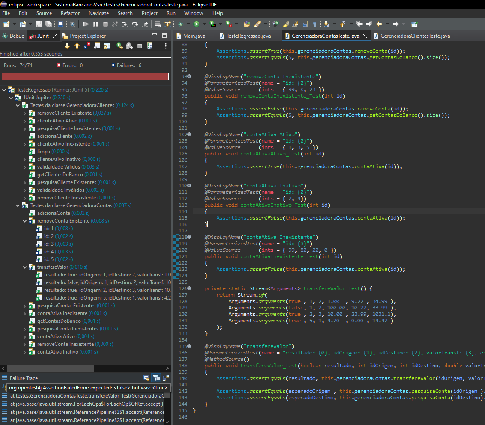

# Atividade de Eng. Softwate - Testes Unitários

## Parte I - Realizar manualmente um teste de funcionalidade do sistema

Ao iniciar a aplicação, o menu apresenta 5 funcionalidades, selecionáveis ao digitar seu respectivo código númerico, sendo elas: 

1. Consultar por um cliente
   
Ao selecioanr essa opção, é requisitado o ID do cliente para ser consultado.
   
Caso o ID pertença à um cliente cadastrado na base, suas informações são apresentadas, contendo ID, Nome, Email, Idade e Status.
   
Caso nenhum cliente seja encontrado com esse ID, a mensagem "Nenhum cliente encontrado!" é apresentada.

2. Consultar por uma conta corrente
   
Ao selecioanr essa opção, é requisitado o ID de uma conta para ser consultado.
   
Caso o ID pertença à uma conta cadastrada na base, suas informações são apresentadas, contendo ID, Saldo e Status.
   
Caso nenhuma conta correnta seja encontrada com esse ID, a mensagem "Conta não encontrada!" é apresentada.

3. Ativar um cliente
    
Ao selecioanr essa opção, é requisitado o ID do cliente que deseja ativar.
    
Caso seja encontrado um cliente com esse ID, o mesmo é ativado, apresentando a mensagem "Cliente ativado com sucesso!".
    
Caso nenhum cliente seja encontrado para esse ID, é apresentada a mensagem "Cliente não encontrado!".
4. Desativar um cliente
    
Ao selecioanr essa opção, é requisitado o ID do cliente que deseja desativar.
    
Caso seja encontrado um cliente com esse ID, o mesmo é desativado, apresentando a mensagem "Cliente desativado com sucesso!".
    
Caso nenhum cliente seja encontrado para esse ID, é apresentada a mensagem "Cliente não encontrado!".
5. Sair
    
Ao selecioanr essa opção, é apresentada a mensagem "################# Sistema encerrado #################" e a aplicação é finalizada.

## Parte II - Implementar os testes de unidade do sistema, utilizando a biblioteca JUnit.

 Os testes para a classe gerenciadoraClientes e gerenciadoraContas foram implementados dentro do packade "testes", nas classes GerenciadoraClientesTeste e GerenciadoraContasTeste, respectivamente, utilizando o JUnit5 e Jupiter.

Ambos os testes foram agrupados em um Suite na classe chamada TesteRegressao, presente no mesmo package. Segue abaixo um print de sua execução através da IDE Eclipse:

 
